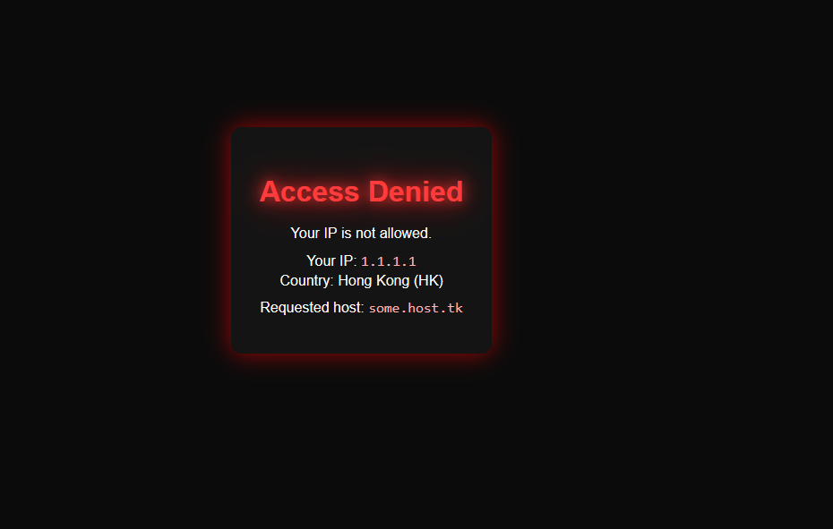
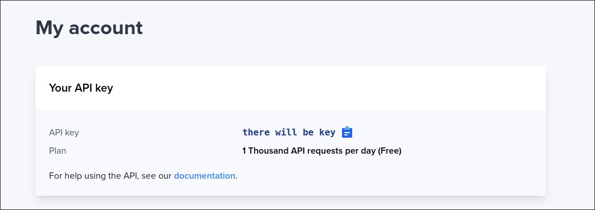
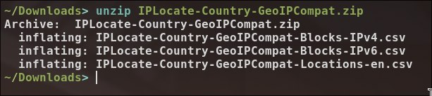

# geo-filt

**geo-filt** is a [Traefik](https://traefik.io/) middleware plugin that filters incoming HTTP requests by IP address and geographic location (country, subnet, custom rules). Written in 

## Features

- Extracts client IP from standard headers: `Forwarded`, `X-Forwarded-For`, `X-Real-IP`.
- IPv4 and IPv6 support.
- Option to allow private ranges (RFC1918, RFC4193, loopback).
- Country-based access filtering (ISO codes).
- IP or subnet allow-list.
- Fully compatible with the [Traefik Plugin System](https://doc.traefik.io/traefik/plugins/overview/).

## Installation

Enable the local plugin in your `traefik.yaml` or `config.yaml`:

```yaml
experimental:
  localPlugins:
    geo-filt:
      moduleName: github.com/eterline/geo-filt
```

### Configuration

Example middleware configuration (dynamic.yaml):

```yaml
http:
  middlewares:
    geofilter:
      plugin:
        geo-filt:
          enabled: true
          header_ip: false # lookup for IP in: `Forwarded`, `X-Forwarded-For`, `X-Real-IP`
          log_level: "info" # debug|info|warn|error
          response: 
            type: "" # none | "html". Then 'content' will use as a filepath.
            content: |
              <!doctypehtml><html lang=en><meta charset=UTF-8><title>Access Denied</title><link href="data:image/svg+xml,<svg xmlns='http://www.w3.org/2000/svg' viewBox='0 0 16 16'><text y='14'>🚫</text></svg>"rel=icon><style>body{font-family:sans-serif;background:#0b0b0b;color:#fff;display:flex;align-items:center;justify-content:center;height:100vh;margin:0}div{max-width:500px;text-align:center;padding:2rem;background:#141414;border-radius:12px;box-shadow:0 0 25px rgba(255,0,0,.6)}h1{margin-bottom:1rem;color:#ff3b3b;text-shadow:0 0 8px #ff3b3b,0 0 20px red;animation:glow 1.5s infinite alternate}p{font-size:1rem;line-height:1.4;margin:.5rem 0}code{color:#ffb3b3}@keyframes glow{from{text-shadow:0 0 8px #ff3b3b,0 0 20px red}to{text-shadow:0 0 18px #ff3b3b,0 0 40px red}}</style><div><h1>Access Denied</h1><p>Your IP is not allowed.<p id=ip>Detecting your IP…<p id=host></div><script>document.getElementById("host").innerHTML="Requested host: <code>"+location.hostname+"</code>";fetch("https://ipwho.is/").then(r=>r.json()).then(d=>{document.getElementById("ip").innerHTML="Your IP: <code>"+d.ip+"</code><br>Country: "+d.country+" ("+d.country_code+")"}).catch(()=>{document.getElementById("ip").textContent="Unable to detect IP"})</script>
          interceptors: # local || ipset || ip2counrty || ip2counrty_full(large ram usage! works as `ip2counrty`)
            - type: "local"
              tag: "allow local network access"
            - type: "ipset"
              tag: "allow my VPS IPs"
              invert: true # true|false
              addrs: ["87.240.129.133", "194.67.72.31", "93.186.225.194"]
              cidrs: ["87.240.129.0/24"]
            - type: "ip2counrty"
              tag: "allow Russia IPs"
              invert: false # true|false
              ip_type: "v4" # v4|v6|all
              base: "/plugins-data/IPLocate/ip-to-country-20251224.csv"
              codes: ["US"]

```

A site from example configuration:


Example router usage:
```yaml
http:
  routers:
    my-app:
      rule: "Host(`some.host.tk`)"
      service: my-app-svc
      middlewares:
        - geofilter@file
```

## Update database

1. Go to [Site](https://www.iplocate.io).
2. Register in site. 
3. Copy api key. 
4. go to address: `https://www.iplocate.io/download/ip-to-country-geolite2.csv?apikey=`<b>\<api_key_here\></b>.
5. Unzip archive. 
6. Move it to container mounted dir and set path in config.

## Roadmap

1. Add base addr filtering (local, ipset, ip2country) - 
2. Add autoupdate from api IPLocate - 
3. Add custom auto update service base - 
4. Will think soon...

## License

[AGPL-3.0](https://www.gnu.org/licenses/agpl-3.0.txt)